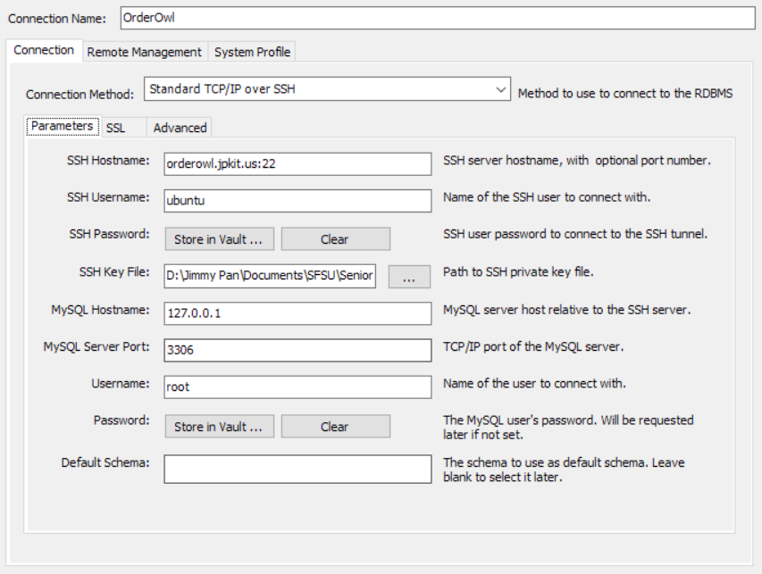

# SSH
*Terminal*
1. Download [id_rsa](id_rsa)
2. Set `id_rsa` file permission
	- [Windows guide](#windows-key-permission)
	- [Linux/MacOS guide](#linuxmacos-key-permission)
3. Open up a terminal
4. Run `ssh -i <Drag and Drop id_rsa here> ubuntu@orderowl.jpkit.us`
5. You are now connected to the server

*Termius*
1. Download [id_rsa](id_rsa)
2. Download [Termius](https://termius.com/download)
3. Add `NEW HOST`
4. Set Address to `orderowl.jpkit.us`
5. Set Username to `ubuntu`
6. Press `Set a Key`
7. Add a `NEW KEY`
8. Import `id_rsa`
9. Leave everything else blank
10. Save configuration
11. Double click newly added host to connect

# Windows Key Permission
1. Right click `id_rsa`
2. Click `Properties`
3. Go to `Security` tab
4. Click `Advance` button
5. Click `Disable inheritance` button
6. Choose the first option
7. Go through each user and delete them, EXCEPT for your account.
8. Press `OK` to save and you are ready to continue to SSH into the server

# Linux/MacOS Key Permission
1. Open up a terminal
2. Run `sudo chmod 600 <Drag and Drop id_rsa here>`
3. Enter your account password if prompted
4. You are ready to continue to SSH into the server

# MySQL
*Terminal*
1. SSH using the [guide](#ssh)
2. Run `mysql -u root -p`
3. Password is `myorderowl`
4. You are now connect to the database

*MySQL Workbench*
1. Download [MySQL Workbench](https://dev.mysql.com/downloads/workbench/)
2. Add a new MySQL Connections
3. Change `Connection Method` to `Standard TCP/IP over SSH`
 
SSH Password: `None` 
SSH Key File: obtain from [SSH guide](#ssh) 
Password: `myorderowl`
4. Press `OK` and enter the password
5. You can now connect to the database